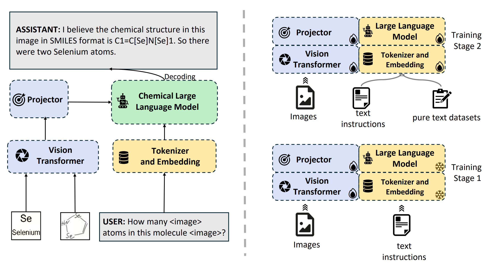

# Official repo for AAAI 2025 paper: "ChemVLM: Exploring the Power of Multimodal Large Language Models in Chemistry Area".  
Our extended version of the paper is at: https://arxiv.org/abs/2408.07246. You can see our Appendix here.

## Abstract

Large Language Models (LLMs) have achieved remarkable success and have been applied across various scientific fields, including chemistry. However, many chemical tasks require the processing of visual information, which cannot be successfully handled by existing chemical LLMs. This brings a growing need for models capable of integrating multimodal information in the chemical domain. In this paper, we introduce \textbf{ChemVLM}, an open-source chemical multimodal large language model specifically designed for chemical applications. ChemVLM is trained on a carefully curated bilingual multimodal dataset that enhances its ability to understand both textual and visual chemical information, including molecular structures, reactions, and chemistry examination questions. We develop three datasets for comprehensive evaluation, tailored to Chemical Optical Character Recognition (OCR), Multimodal Chemical Reasoning (MMCR), and Multimodal Molecule Understanding tasks. We benchmark ChemVLM against a range of open-source and proprietary multimodal large language models on various tasks. Experimental results demonstrate that ChemVLM achieves competitive performance across all evaluated tasks. Our code is available at https://github.com/AI4Chem/ChemVlm.

## Model

Use our model at: https://huggingface.co/AI4Chem

The architecture of our model is as follows.



## Training

Our training refers to the InternVL-v1.5 repo. You can find it at https://internvl.readthedocs.io/en/latest/internvl1.5/finetune.html. Create a folder named 'InternVL' under root directory and follow their instructions. Note that you should first run 'merge_vit_and_llm.py' to get the initial ChemVLM model checkpoint without training.

## Evaluation  
Our proposed benchmarks are in the ```datagen``` folder:  
```
MMChemOCR: datagen/mm_chem_ocr.jsonl.test.jsonl
MMCR-bench: datagen/mm_pure_fix.jsonl
MMChemBench(mol-caption):  datagen/chembench_mol2caption.jsonl
MMChemBench(property-prediction: datagen/chembench_property.jsonl 
```
You can find the results generation files in the ```evaluation``` folder.  
For SMILES ocr task(MMChemOCR), see both evaluation/test_chemvlm_res.py and evaluation/test_smiles_ocr.py;    
for other tasks, see evaluation/test_chemvlm_res.py.(Some other tasks we add after paper submission is also here.)

Steps:  
1. Create an 'image' folder under the root dir.
2. Download the image files <a href='https://drive.google.com/drive/folders/1zCFMTtK58SofvF5ygU21AAKcOx9L7alC?usp=drive_link'>here</a> and put them under the image folder. Like this: 'image/chem_ocr/...'. Remember to keep the initial name of the folder!('mm_pure_fix' refers to MMCR-bench)
3. Use test_chemvlm_res.py to generate answers to questions.  
4. For SMILES ocr task, use test_smiles_ocr.py for exact scores of answers. For MMCR tasks, use GPT series as a judge to calculate scores. For MMChemBench, you can read scores easily since they are multiple choice problems.  

## Reference  
If this help you, please kindly cite:

```
@misc{li2024chemvlmexploringpowermultimodal,
      title={ChemVLM: Exploring the Power of Multimodal Large Language Models in Chemistry Area}, 
      author={Junxian Li and Di Zhang and Xunzhi Wang and Zeying Hao and Jingdi Lei and Qian Tan and Cai Zhou and Wei Liu and Yaotian Yang and Xinrui Xiong and Weiyun Wang and Zhe Chen and Wenhai Wang and Wei Li and Shufei Zhang and Mao Su and Wanli Ouyang and Yuqiang Li and Dongzhan Zhou},
      year={2024},
      eprint={2408.07246},
      archivePrefix={arXiv},
      primaryClass={cs.LG},
      url={https://arxiv.org/abs/2408.07246}, 
}
```
